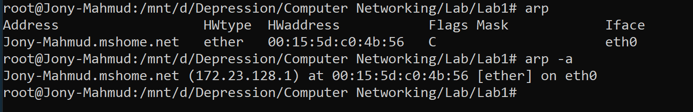

# ARP Command

## Introduction

**Address Resolution Protocol (ARP)** is a critical network protocol operating at the Data Link Layer (Layer 2) of the OSI model. It provides the essential mechanism for mapping logical network addresses (IP addresses) to physical hardware addresses (MAC addresses) within local area networks (LANs).

### Key Objectives

- Establish IP-to-MAC address mappings
- Enable seamless communication between network devices
- Maintain dynamic address resolution tables
- Support network troubleshooting and monitoring

---

## Protocol Overview

### ARP Architecture

```
┌─────────────────┐    ARP Request     ┌─────────────────┐
│   Source Host   │ ──────────────────► │ Destination Host│
│  IP: 192.168.1.2│                    │  IP: 192.168.1.5│
│  MAC: Unknown   │ ◄────────────────── │  MAC: Known     │
└─────────────────┘    ARP Reply       └─────────────────┘
```

### Why ARP is Essential

| **Aspect**     | **Network Layer (IP)** | **Data Link Layer (MAC)** |
| -------------------- | ---------------------------- | ------------------------------- |
| **Purpose**    | Logical addressing           | Physical addressing             |
| **Scope**      | End-to-end routing           | Local network segment           |
| **Format**     | 192.168.1.100                | 00:1A:2B:3C:4D:5E               |
| **Visibility** | Router-to-router             | Switch/Hub level                |

### ARP Process Flow

1. **Request Phase**: Host broadcasts ARP request for target IP
2. **Response Phase**: Target host responds with its MAC address
3. **Cache Update**: Both hosts update their ARP tables
4. **Communication**: Direct MAC-to-MAC frame transmission begins

---

## Syntax & Options

### Basic Syntax

```bash
arp [options] [hostname/IP_address]
```

### Command Options Reference

| **Option** | **Long Form** | **Description**         | **Example**                         |
| ---------------- | ------------------- | ----------------------------- | ----------------------------------------- |
| `-a`           | `--all`           | Display all ARP entries       | `arp -a`                                |
| `-d`           | `--delete`        | Delete specific ARP entry     | `arp -d 192.168.1.10`                   |
| `-s`           | `--set`           | Add static ARP entry          | `arp -s 192.168.1.10 00:AA:BB:CC:DD:EE` |
| `-n`           | `--numeric`       | Show numerical addresses only | `arp -an`                               |
| `-v`           | `--verbose`       | Verbose output                | `arp -av`                               |
| `-i`           | `--device`        | Select specific interface     | `arp -i eth0`                           |

## Practical Examples

### Example 1: Viewing Complete ARP Table

```bash
$ arp -a
```

**Expected Output:**

```
? (192.168.1.1) at 00:50:56:c0:00:08 [ether] on eth0
gateway.local (192.168.1.254) at aa:bb:cc:dd:ee:ff [ether] on eth0
```

---

### Example 2: Adding Static ARP Entry

```bash
$ sudo arp -s 192.168.1.50 00:11:22:33:44:55
```

**Use Cases:**

- Prevent ARP spoofing attacks
- Ensure consistent routing to critical servers
- Testing network configurations

---

### Example 3: Removing ARP Entry

```bash
$ sudo arp -d 192.168.1.50
```

**When to Use:**

- Resolve IP conflicts
- Clear outdated MAC mappings
- Force ARP table refresh

---

### Example 4: Interface-Specific Queries

```bash
$ arp -i eth0 -a
```

**Benefits:**

- Multi-homed system management
- Interface-specific troubleshooting
- Network segmentation analysis

---

## Sample Output & Analysis



### Detailed Output Analysis

#### **Command Output Breakdown:**

#### Field Explanations

| **Field**            | **Value**            | **Explanation**                                                                              |
| -------------------------- | -------------------------- | -------------------------------------------------------------------------------------------------- |
| **Address/Hostname** | `Jony-Mahmud.mshome.net` | **Network identifier** - Fully qualified domain name (FQDN) or hostname of the target device |
| **HWtype**           | `ether`                  | **Hardware Type** - Indicates Ethernet protocol (most common LAN technology)                 |
| **HWaddress**        | `00:15:5d:c0:4b:56`      | **MAC Address** - Unique 48-bit hardware identifier (6 octets in hexadecimal)                |
| **Flags**            | `C`                      | **Status Flag** - 'C' = Complete entry (MAC address successfully resolved)                   |
| **Mask**             | *(empty)*                | **Network Mask** - Usually empty for standard Ethernet entries                               |
| **Iface**            | `eth0`                   | **Network Interface** - Physical/virtual network adapter used for communication              |

#### Advanced Flag Meanings

| **Flag** | **Status**    | **Description**              |
| -------------- | ------------------- | ---------------------------------- |
| `C`          | **Complete**  | Address resolution successful      |
| `M`          | **Permanent** | Static/manual entry (won't expire) |
| `P`          | **Published** | Entry published for proxy ARP      |

#### Command Variants Comparison

| **Command** | **Output Format**  | **Information Displayed**            |
| ----------------- | ------------------------ | ------------------------------------------ |
| `arp`           | **Tabular Format** | Structured columns with headers            |
| `arp -a`        | **List Format**    | Single-line entries with IP in parentheses |

### Real-World Interpretation

**This output reveals:**

- **Local Network**: Device is connected to `mshome.net` domain (Microsoft virtual network)
- **Host Identity**: `172.23.128.1` is likely the default gateway or host system
- **Interface**: Communication occurs through `eth0` (primary Ethernet adapter)
- **Connectivity**: Active ARP entry indicates recent/ongoing communication

---

---

## Summary

### Key Takeaways

| **Aspect**     | **Details**                                                  |
| -------------------- | ------------------------------------------------------------------ |
| **Purpose**    | Maps IP addresses to MAC addresses for local network communication |
| **Scope**      | Limited to local network segment (same broadcast domain)           |
| **Types**      | Dynamic (auto-learned) and  Static (manually configured) entries  |
| **Security**   | Vulnerable to spoofing; requires proactive monitoring              |
| **Management** | Essential for network troubleshooting and optimization             |

### Professional Applications

- **Network Troubleshooting**: Diagnose connectivity issues and IP conflicts
- **Security Monitoring**: Detect ARP spoofing and unauthorized devices
- **Network Mapping**: Discover active devices and their MAC addresses
- **Performance Tuning**: Optimize cache settings for large networks
- **Access Control**: Implement MAC-based security policies

---
