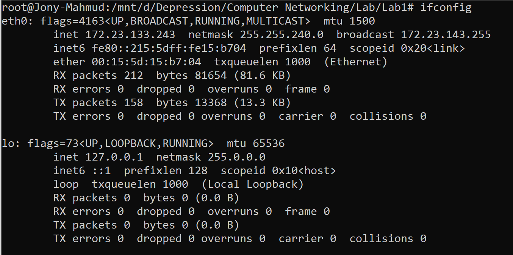

# Network Interface Configuration

This document summarizes the network interfaces on a Linux system as displayed by the `ifconfig` command.

---

---

## Interface: `eth0`

| Property                  | Value                                             | Description                                                            |
| ------------------------- | ------------------------------------------------- | ---------------------------------------------------------------------- |
| **Status Flags**    | `UP`, `BROADCAST`, `RUNNING`, `MULTICAST` | Interface is active, supports broadcast/multicast, and is operational. |
| **MTU**             | `1500`                                          | Maximum Transmission Unit (bytes).                                     |
| **IPv4 Address**    | `172.23.133.243`                                | Primary IPv4 address.                                                  |
| **Netmask**         | `255.255.240.0`                                 | Subnet mask for network segmentation.                                  |
| **Broadcast**       | `172.23.143.255`                                | Broadcast address for subnet.                                          |
| **IPv6 Address**    | `fe80::215:5dff:fe15:b704/64`                   | Link-local IPv6 address (prefix /64).                                  |
| **MAC Address**     | `00:15:5d:15:b7:04`                             | Hardware (Ethernet) address.                                           |
| **TX Queue Length** | `1000`                                          | Transmit queue length.                                                 |

**Traffic Statistics:**

- **Received (RX):** 212 packets, 81.6 KB &nbsp;|&nbsp; 0 errors, 0 dropped, 0 overruns, 0 frame errors
- **Transmitted (TX):** 158 packets, 13.3 KB &nbsp;|&nbsp; 0 errors, 0 dropped, 0 overruns, 0 carrier errors, 0 collisions

---

## Interface: `lo` (Loopback)

| Property                  | Value                             | Description                                   |
| ------------------------- | --------------------------------- | --------------------------------------------- |
| **Status Flags**    | `UP`, `LOOPBACK`, `RUNNING` | Loopback interface is active and operational. |
| **MTU**             | `65536`                         | Maximum Transmission Unit (bytes).            |
| **IPv4 Address**    | `127.0.0.1`                     | Standard loopback address.                    |
| **Netmask**         | `255.0.0.0`                     | Loopback subnet mask.                         |
| **IPv6 Address**    | `::1/128`                       | IPv6 loopback address.                        |
| **TX Queue Length** | `1000`                          | Transmit queue length.                        |

**Traffic Statistics:**

- **Received (RX):** 0 packets, 0 bytes &nbsp;|&nbsp; 0 errors, 0 dropped, 0 overruns, 0 frame errors
- **Transmitted (TX):** 0 packets, 0 bytes &nbsp;|&nbsp; 0 errors, 0 dropped, 0 overruns, 0 carrier errors, 0 collisions

---

## Notes

- **`eth0`** is the primary network interface, configured with both IPv4 and IPv6 addresses, and is currently active with no errors reported.
- **`lo`** is the loopback device, used for internal host communication, also active and error-free.
- Both interfaces show no transmission or reception errors, indicating healthy network operation.

---
