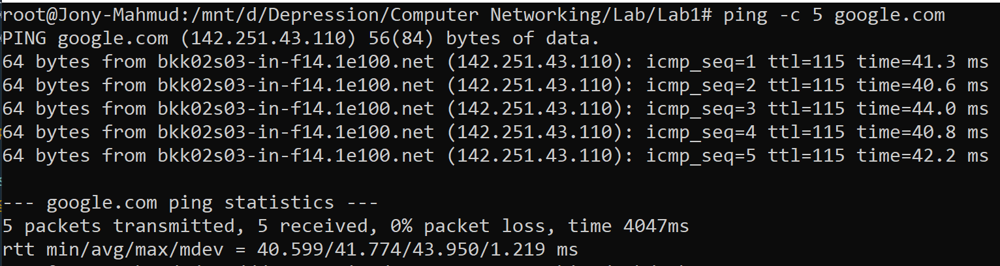

# Ping Command 
## Overview

The `ping` command is a fundamental network utility used to verify the reachability of a host (such as a computer, server, or website) on an IP network. It also provides valuable metrics about network latency and packet loss, making it an essential tool for diagnosing connectivity issues.

---

## How Ping Works

1. **Initiation:**  
    The user invokes the `ping` command with a target IP address or domain name.

2. **Packet Transmission:**  
    The command sends a series of ICMP (Internet Control Message Protocol) Echo Request packets to the specified target.

3. **Response Handling:**  
    If the target is reachable, it responds with ICMP Echo Reply packets.

4. **Result Reporting:**  
    The command summarizes the results, including:
    - Number of packets sent, received, and lost
    - Minimum, maximum, and average round-trip times (RTT)

---

## Syntax

```sh
ping <hostname or IP address>
```

---

## Common Options

| Option          | Description                  | Example                   | Details                                                                                      |
|-----------------|-----------------------------|---------------------------|----------------------------------------------------------------------------------------------|
| `-c <count>`    | Packet count                | `ping -c 5 google.com`    | Sends a specified number of packets (default: continuous until interrupted).                 |
| `-i <interval>` | Interval between packets    | `ping -i 2 google.com`    | Sets the wait time (in seconds) between packets (default: 1s; root required for <0.2s).      |
| `-s <size>`     | Packet size                 | `ping -s 100 google.com`  | Specifies the number of data bytes to send (default: 56). Useful for testing MTU.            |
| `-w <timeout>`  | Total timeout               | `ping -w 10 google.com`   | Sets a deadline (in seconds) for the entire ping session.                                    |
| `-W <timeout>`  | Per-packet timeout          | `ping -W 2 google.com`    | Maximum wait time (in seconds) for each reply.                                               |
| `-t <ttl>`      | Time-To-Live (TTL)          | `ping -t 64 google.com`   | Sets the maximum number of network hops for packets.                                         |
| `-f`            | Flood ping                  | `ping -f google.com`      | Sends packets as rapidly as possible (root only). Used for stress testing.                   |
| `-q`            | Quiet output                | `ping -c 5 -q google.com` | Displays only summary statistics, suppressing per-packet output.                             |
| `-D`            | Timestamp                   | `ping -D google.com`      | Prepends a timestamp to each output line (useful for logging).                               |
| `-n`            | Numeric output              | `ping -n google.com`      | Displays IP addresses only, without resolving hostnames.                                     |

---

## Example Usage

```sh
ping -c 5 google.com
```


- `ping`: Initiates the connectivity test.
- `-c 5`: Sends exactly 5 ICMP Echo Request packets.
- `google.com`: Target host (resolved to an IP address via DNS).

---

## Sample Output Explained

**First Line:**
```
PING google.com (142.251.43.110) 56(84) bytes of data.
```
- `google.com`: Target domain.
- `142.251.43.110`: Resolved IP address.
- `56 bytes`: ICMP payload size.
- `84 bytes`: Total packet size (payload + header).

**Reply Lines:**
```
64 bytes from bkk02s03-in-f14.1e100.net (142.251.43.110): icmp_seq=1 ttl=115 time=41.3 ms
```
- `64 bytes`: Size of the reply packet.
- `from ...`: Reverse DNS name of the responder.
- `icmp_seq=1`: Sequence number of the reply.
- `ttl=115`: Remaining hops before packet expiry.
- `time=41.3 ms`: Round-trip time for this packet.

**Summary Section:**
```
--- google.com ping statistics ---
5 packets transmitted, 5 received, 0% packet loss, time 4047ms
```
- `5 packets transmitted`: Number of requests sent.
- `5 received`: Replies received.
- `0% packet loss`: No packets lost.
- `time 4047ms`: Total duration of the test.

**RTT Statistics:**
```
rtt min/avg/max/mdev = 40.599/41.774/43.950/1.219 ms
```
- `min`: Minimum round-trip time.
- `avg`: Average round-trip time.
- `max`: Maximum round-trip time.
- `mdev`: Mean deviation (jitter).

---

## Typical Use Cases

- Verifying if a network device or website is online.
- Troubleshooting network connectivity and latency issues.
- Measuring network performance and stability.

---

## Key Points

- If the host is unreachable, the output will show "Request timed out."
- `ping` is available on Windows, Linux, and macOS, with similar syntax.
- It is a primary tool for basic network troubleshooting and diagnostics.

