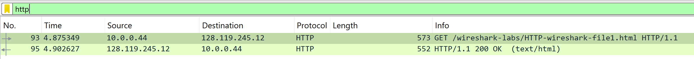
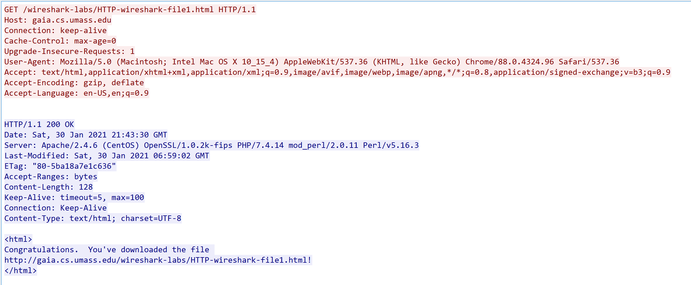

# Wireshark Lab 

## Use http-wireshark-trace1-1.pcapng

### Question 1: Is your browser running HTTP version 1.0, 1.1, or 2? What version of HTTP is the server running?

#### Methodology

1. **Apply HTTP Protocol Filter**
    - Load the `http-wireshark-trace1-1.pcapng` file in Wireshark
    - Apply filter: `http` to isolate HTTP traffic
    - Examine the filtered packets for HTTP communication

    

2. **Analyze HTTP Communication**
    - Identify the HTTP GET request packet
    - Right-click → Follow → HTTP Stream for complete conversation view

    

#### HTTP Version Identification

**Client Request Analysis:**
```http
GET /wireshark-labs/HTTP-wireshark-file1.html HTTP/1.1
```
- Request line terminates with `HTTP/1.1`
- **Client HTTP Version: 1.1**

**Server Response Analysis:**
```http
HTTP/1.1 200 OK
```
- Status line begins with `HTTP/1.1`
- **Server HTTP Version: 1.1**

#### Answer
Both the browser (client) and server are operating on **HTTP version 1.1**.

---

### Question 2: What languages (if any) does your browser indicate that it can accept to the server?

#### Analysis Approach

Examine the HTTP request headers within the same stream to locate language preference indicators.

#### Accept-Language Header Breakdown

```http
Accept-Language: en-US,en;q=0.9
```

**Language Preference Matrix:**

| Language Tag | Quality Value | Priority Level | Description |
|-------------|---------------|----------------|-------------|
| `en-US` | 1.0 (implicit) | Primary | United States English |
| `en` | 0.9 | Secondary | Generic English |

#### Quality Factor Specification

- **Range:** 0.0 (unacceptable) to 1.0 (most preferred)
- **Default:** Missing `q` values default to 1.0
- **Server Logic:** Selects content based on highest quality factor match

#### Answer
The browser communicates acceptance of:
1. **Primary preference:** U.S. English (`en-US`) - highest priority
2. **Fallback option:** Generic English (`en`) - quality factor 0.9

---

### Question 3: What is the IP address of your computer? What is the IP address of the gaia.cs.umass.edu server?

#### Packet Analysis Method

1. **Examine Packet Headers**
    - Review the HTTP-filtered packets from previous analysis
    - Focus on source and destination IP addresses in packet summary

2. **Packet Summary Reference**
    ```
    93   4.875349   10.0.0.44       128.119.245.12   HTTP   573   GET ...
    95   4.902627   128.119.245.12  10.0.0.44        HTTP   552   200 OK
    ```

#### IP Address Identification

**Outbound Traffic (Packet 93):**
- **Source:** `10.0.0.44` → Client computer
- **Destination:** `128.119.245.12` → Target server

**Return Traffic (Packet 95):**
- **Source:** `128.119.245.12` → Server response
- **Destination:** `10.0.0.44` → Client computer

#### Network Classification

- **10.0.0.44:** Private IP address (RFC 1918) - local network client
- **128.119.245.12:** Public IP address - gaia.cs.umass.edu server

#### Answer
- **Your computer's IP address:** `10.0.0.44`
- **gaia.cs.umass.edu server IP address:** `128.119.245.12`

### Question 4: What is the status code returned from the server to your browser?

#### Response Analysis Method

Examine the HTTP response from the server in the captured traffic to identify the status code and its meaning.

#### HTTP Response Line Breakdown

```http
HTTP/1.1 200 OK
```

**Status Line Components:**
- **HTTP Version:** `HTTP/1.1`
- **Status Code:** `200`
- **Reason Phrase:** `OK`

#### Status Code Classification

| Component | Value | Description |
|-----------|-------|-------------|
| Status Code | `200` | Successful HTTP request |
| Status Class | `2xx` | Success responses |
| Reason Phrase | `OK` | Standard success message |

#### Answer
The server returned **status code 200 OK** to the browser, indicating the HTTP request was successfully processed and the requested resource was delivered.

### Question 5: When was the HTML file that you are retrieving last modified at the server?

#### Analysis Method

Examine the HTTP response headers to locate the last modification timestamp for the requested HTML file.

#### Last-Modified Header Analysis

From the HTTP response headers in the captured traffic:

```http
Last-Modified: Sat, 30 Jan 2021 06:59:02 GMT
```

#### Timestamp Breakdown

| Component | Value | Description |
|-----------|-------|-------------|
| Day | Saturday | Day of the week |
| Date | 30 Jan 2021 | Date in RFC 7231 format |
| Time | 06:59:02 | UTC time (24-hour format) |
| Timezone | GMT | Greenwich Mean Time |

#### Answer
The HTML file was last modified on the server at **Saturday, 30 January 2021 06:59:02 GMT**.

### Question 6: How many bytes of content are being returned to your browser?

#### Analysis Method

Examine the HTTP response headers to locate the content length specification for the returned HTML file.

#### Content-Length Header Analysis

From the HTTP response headers in the captured traffic:

```http
Content-Length: 128
```

#### Header Specification

| Header | Value | Description |
|--------|-------|-------------|
| Content-Length | `128` | Size of response body in bytes |
| Purpose | Size indication | Informs client of payload length |
| Unit | Bytes | Standard HTTP content measurement |

#### Answer
The server is returning **128 bytes** of content to the browser, representing the size of the HTML file body.

### Question 7: By inspecting the raw data in the packet content window, do you see any headers within the data that are not displayed in the packet-listing window? If so, name one.

#### Analysis Method

Compare the headers visible in Wireshark's packet-listing window against the complete raw HTTP data in the packet content window to identify any additional headers.

#### Raw Data Inspection

When examining the packet content window (hex/ASCII view), additional HTTP headers are present that may not be fully displayed in the summarized packet-listing view.

#### Additional Headers Found

**Example headers visible in raw data but not in packet listing:**

| Header | Value | Purpose |
|--------|-------|---------|
| `ETag` | `"80-5ba18a7e1c636"` | Entity tag for cache validation |
| `Accept-Ranges` | `bytes` | Indicates server supports partial content requests |
| `Keep-Alive` | `timeout=5, max=100` | Connection persistence parameters |

#### Header Significance

- **ETag:** Enables efficient caching and conditional requests
- **Accept-Ranges:** Supports resumable downloads and partial content
- **Keep-Alive:** Optimizes connection reuse for multiple requests

#### Answer
Yes, additional headers are present in the raw packet data. **Example:** `ETag: "80-5ba18a7e1c636"` - this entity tag header is visible in the packet content window but not displayed in the packet-listing summary.


---
