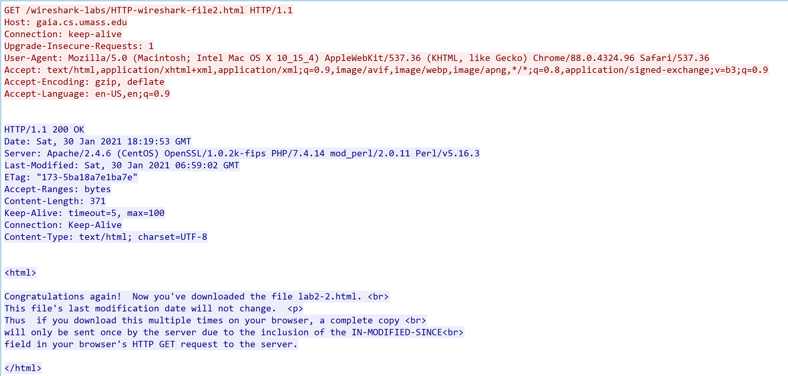

# Wireshark Lab 

## Use http-wireshark-trace2-1.pcapng

### Question 8: Inspect the contents of the first HTTP GET request from your browser to the server. Do you see an "IF-MODIFIED-SINCE" line in the HTTP GET?

**Steps to Analyze:**

1. **Apply HTTP Protocol Filter**
    - Load the `http-wireshark-trace2-1.pcapng` file in Wireshark
    - Apply filter: `http` to isolate HTTP traffic
    - Examine the filtered packets for HTTP communication

    

2. **Analyze HTTP Communication**
    - Identify the HTTP GET request packet
    - Right-click → Follow → HTTP Stream for complete conversation view

    
    

**HTTP GET Request Headers:**

```
GET /wireshark-labs/HTTP-wireshark-file2.html HTTP/1.1
Host: gaia.cs.umass.edu
Connection: keep-alive
Upgrade-Insecure-Requests: 1
User-Agent: Mozilla/5.0 (Macintosh; Intel Mac OS X 10_15_4) ...
Accept: text/html,application/xhtml+xml,application/xml;q=0.9,...
Accept-Encoding: gzip, deflate
Accept-Language: en-US,en;q=0.9
```

**Analysis:**
- The first HTTP GET request does not contain an `If-Modified-Since` header
- This indicates it's an initial request for the resource, not a conditional request

**Answer:** No, the first HTTP GET request does not contain an `If-Modified-Since` line.

---

### Question 9: Inspect the contents of the server response. Did the server explicitly return the contents of the file? How can you tell?

**Steps to Analyze:**

1. **Examine the Server Response**
    - Locate the HTTP response packet corresponding to the first GET request
    - Analyze the response headers and body content

**Server Response Analysis:**

```
HTTP/1.1 200 OK
Date: Sat, 30 Jan 2021 18:19:53 GMT
Server: Apache/2.4.6 (CentOS) OpenSSL/1.0.2k-fips PHP/5.4.16 mod_perl/2.0.11 Perl/v5.16.3
Last-Modified: Sat, 30 Jan 2021 18:19:53 GMT
ETag: "173-5ba5a2e9d9b40"
Accept-Ranges: bytes
Content-Length: 371
Content-Type: text/html; charset=UTF-8

<html>
Congratulations again! Now you've downloaded the file lab2-2.html.<br>
This file's last modification date will not change, so you can use Wireshark to see what happens when you download the file again and compare the two downloads.
<br><br>

</html>
```

**Analysis:**

- **Status Code:** `200 OK` indicates successful retrieval and explicit content delivery
- **Content-Length:** `371` bytes confirms actual file data transmission
- **Response Body:** Contains the complete HTML content of the requested file
- **Content-Type:** `text/html; charset=UTF-8` specifies the file format

**Answer:** Yes, the server explicitly returned the contents of the file. This is evident from:
1. The `200 OK` status code indicating successful content delivery
2. The presence of `Content-Length: 371` header showing actual data transmission
3. The complete HTML file content in the response body

---

### Question 10: Now inspect the contents of the second HTTP GET request from your browser to the server. Do you see an "IF-MODIFIED-SINCE:" line in the HTTP GET? If so, what information follows the "IF-MODIFIED-SINCE:" header?

**Steps to Analyze:**

1. **Locate the Second HTTP GET Request**
    - Continue examining the HTTP traffic in Wireshark
    - Identify the second GET request for the same resource
    - Analyze the request headers for conditional request elements

**Second HTTP GET Request Headers:**

```
GET /wireshark-labs/HTTP-wireshark-file2.html HTTP/1.1
Host: gaia.cs.umass.edu
Connection: keep-alive
Cache-Control: max-age=0
Upgrade-Insecure-Requests: 1
User-Agent: Mozilla/5.0 (Macintosh; Intel Mac OS X 10_15_4) ...
Accept: text/html,application/xhtml+xml,application/xml;q=0.9,...
Accept-Encoding: gzip, deflate
Accept-Language: en-US,en;q=0.9
If-None-Match: "173-5ba18a7e1ba7e"
If-Modified-Since: Sat, 30 Jan 2021 06:59:02 GMT
```

**Analysis:**

- **If-Modified-Since Header Present:** Yes, the second HTTP GET request contains an `If-Modified-Since` header
- **Header Value:** `Sat, 30 Jan 2021 06:59:02 GMT`
- **Purpose:** This is a conditional request asking the server to only send the file if it has been modified since the specified date
- **Browser Behavior:** The browser is using cached information from the first request to make a conditional request

**Answer:** Yes, the second HTTP GET request includes an `If-Modified-Since:` line. The information that follows is the timestamp `Sat, 30 Jan 2021 06:59:02 GMT`, which represents the last modification date of the file from the server's previous response.

---

### Question 11: What is the HTTP status code and phrase returned from the server in response to this second HTTP GET? Did the server explicitly return the contents of the file? Explain.

**Steps to Analyze:**

1. **Examine the Second Server Response**
    - Locate the HTTP response packet corresponding to the second GET request
    - Analyze the response headers and status code

**Second Server Response:**

```
HTTP/1.1 304 Not Modified
Date: Sat, 30 Jan 2021 18:19:56 GMT
Server: Apache/2.4.6 (CentOS) OpenSSL/1.0.2k-fips PHP/5.4.16 mod_perl/2.0.11 Perl/v5.16.3
Connection: Keep-Alive
Keep-Alive: timeout=5, max=99
ETag: "173-5ba18a7e1ba7e"
```

**Analysis:**

- **Status Code:** `304 Not Modified`
- **No Content-Length Header:** Indicates no body content was transmitted
- **ETag Header:** Confirms the cached version is still valid
- **Browser Behavior:** The browser uses its cached copy instead of downloading again

**Answer:** The HTTP status code is `304 Not Modified`. No, the server did not explicitly return the contents of the file. The 304 status code instructs the browser to use its cached copy since the file has not been modified since the date specified in the `If-Modified-Since` header. This saves bandwidth by avoiding unnecessary retransmission of unchanged content.
