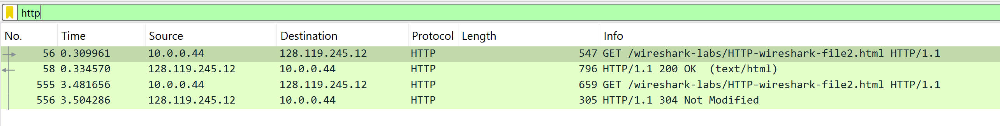
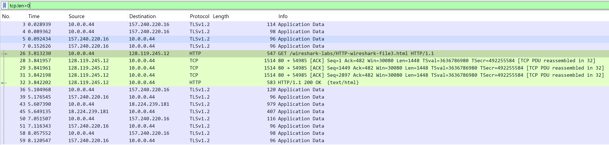

# Wireshark Lab 

## Use http-wireshark-trace3-1.pcapng

### Question 12: How many HTTP GET request messages did your browser send? Which packet number in the trace contains the GET message for the Bill of Rights?

**Steps to Analyze:**

1. **Apply HTTP Protocol Filter**
    - Load the `http-wireshark-trace3-1.pcapng` file in Wireshark
    - Apply filter: `http` to isolate HTTP traffic
    - Examine the filtered packets for HTTP communication

    

2. **Analyze the Trace Results**

    From the trace output:

    ```
    No.   Time       Source         Destination    Protocol Length Info
    26    3.813230   10.0.0.44      128.119.245.12 HTTP     547    GET /wireshark-labs/HTTP-wireshark-file3.html HTTP/1.1
    32    3.842202   128.119.245.12 10.0.0.44      HTTP     583    HTTP/1.1 200 OK (text/html)
    ```

3. **Count GET Requests**

    In Wireshark, every HTTP GET request appears in the Info column as:
    ```
    GET /wireshark-labs/HTTP-wireshark-fileX.html HTTP/1.1
    ```

    From the trace, we can identify:
    - Packet 26: GET request for `/wireshark-labs/HTTP-wireshark-file3.html` (Bill of Rights)

4. **Identify the Bill of Rights Packet**

    The Bill of Rights document corresponds to `HTTP-wireshark-file3.html` in the UMass Wireshark labs.

**Answer:**
- The browser sent **1 HTTP GET request** for the Bill of Rights
- The GET message for the Bill of Rights is contained in **packet number 26**

---


### Question 13: Which packet number in the trace contains the status code and phrase associated with the response to the HTTP GET request?

**Analysis:**

From the trace capture:

```
No.   Time       Source         Destination    Protocol Length Info
26    3.813230   10.0.0.44      128.119.245.12 HTTP     547    GET /wireshark-labs/HTTP-wireshark-file3.html HTTP/1.1
32    3.842202   128.119.245.12 10.0.0.44      HTTP     583    HTTP/1.1 200 OK (text/html)
```

- **Packet 26:** Browser sends the GET request
- **Packet 32:** Server sends the response, including the status code and phrase `200 OK`

**Answer:**
The packet containing the status code and phrase for the HTTP GET response is **packet number 32**.

---


### Question 14: What is the status code and phrase in the response?

From the server response in your capture:

```
HTTP/1.1 200 OK (text/html)
```

**Answer:**
- **Status code:** 200
- **Phrase:** OK

This indicates that the server successfully returned the requested file.

---


### Question 15: How many data-containing TCP segments were needed to carry the single HTTP response and the text of the Bill of Rights?

**Analysis:**



From the packet capture analysis, we can observe that the single HTTP response carrying the Bill of Rights was fragmented across multiple TCP segments due to Maximum Segment Size (MSS) limitations.

**TCP Segmentation Breakdown:**

| TCP Segment | Sequence Number | Length (bytes) | Description |
|-------------|----------------|----------------|-------------|
| 1 | 1 | 1,448 | First segment containing HTTP headers and initial content |
| 2 | 1,449 | 1,448 | Second segment with continuation of document data |
| 3 | 2,897 | 1,448 | Third segment with more document content |
| 4 | 4,345 | 583 | Final segment completing the HTTP response |

**Key Observations:**

- The server fragmented the response because the total response size exceeded the TCP Maximum Segment Size (MSS)
- Each segment carries actual application data (HTTP response content)
- The final segment, while smaller at 583 bytes, still contains data and therefore counts as a data-containing segment
- Wireshark automatically reassembles these segments to display the complete HTTP response

**Answer:**
The single HTTP response and Bill of Rights text required **4 data-containing TCP segments** for transmission.
