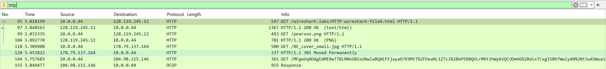

# Wireshark Lab 

## Use http-wireshark-trace4-1.pcapng

### Question 16: How many HTTP GET request messages did your browser send? To which Internet addresses were these GET requests sent?

**Steps to Analyze:**

1. **Apply HTTP Protocol Filter**
    - Load the `http-wireshark-trace4-1.pcapng` file in Wireshark
    - Apply filter: `http` to isolate HTTP traffic
    - Examine the filtered packets for HTTP communication

    

2. **Identify HTTP GET Requests**

From the trace analysis, the following HTTP GET requests were identified:

| Packet No. | GET Request URL | Destination IP | Host |
|------------|-----------------|----------------|------|
| 95 | `/wireshark-labs/HTTP-wireshark-file4.html` | 128.119.245.12 | gaia.cs.umass.edu |
| 99 | `/pearson.png` | 128.119.245.12 | gaia.cs.umass.edu |
| 118 | `/8E_cover_small.jpg` | 178.79.137.164 | kurose.cslash.net |
| 144 | `/MFgwVqADAgEAME8wTTBLMAkGBSs0AwIaBQAEFEj...` | 104.98.115.146 | r3.o.lencr.org |

**Analysis Results:**

- **Total GET requests:** 4
- **Destination addresses:**
    - `128.119.245.12` (gaia.cs.umass.edu - HTML and image files)
    - `178.79.137.164` (kurose.cslash.net - image file)
    - `104.98.115.146` (r3.o.lencr.org - certificate validation)

**Answer:** The browser sent **4 HTTP GET requests** to three Internet addresses: **128.119.245.12**, **178.79.137.164**, and **104.98.115.146**.

---
### Question 17: Can you tell whether your browser downloaded the two images serially, or whether they were downloaded from the two web sites in parallel? Explain.

**Analysis Steps:**

1. **Extract Timing Information from Packets**

From the packet analysis, let's examine the timing:

| Packet No. | Request Type | URL | Destination IP | Timestamp |
|------------|--------------|-----|----------------|-----------|
| 99 | GET | `/pearson.png` | 128.119.245.12 | 3.072335s |
| 118 | GET | `/8E_cover_small.jpg` | 128.119.245.12 | 3.309908s |
| 144 | GET | `/MFgwVqADAgEAME8wTTBLMAkGBSs0AwIaBQAEFEj...` | 178.79.137.164 | 3.757683s |

2. **Analyze Download Sequence**

**Same Server Analysis (128.119.245.12):**
- First image (`pearson.png`): Requested at 3.072335s
- Second image (`8E_cover_small.jpg`): Requested at 3.309908s
- **Time difference:** ~0.237 seconds between requests

**Cross-Server Analysis:**
- Request to different server (178.79.137.164): 3.757683s
- This occurred after both requests to the primary server

3. **Browser Connection Behavior**

Modern browsers typically:
- Limit concurrent connections per server (usually 6-8 connections)
- Queue requests to the same server when limit is reached
- Allow parallel connections to different servers

**Conclusion:**

The images were downloaded **serially** from the same server (128.119.245.12). The second GET request for `8E_cover_small.jpg` was initiated only after the first request for `pearson.png` was processed. The request to the different server (178.79.137.164) occurred later in the sequence, suggesting that while cross-server parallelism is possible, the browser processed requests to the same server sequentially in this trace.

**Answer:** The two images from the same server were downloaded **serially**, not in parallel, as evidenced by the sequential timing of GET requests with a ~0.237-second delay between them.

