 # DNS Wireshark Lab Analysis

## Overview
This lab demonstrates DNS (Domain Name System) functionality through packet analysis using Wireshark. The lab covers DNS queries, responses, caching behavior, and different types of DNS record lookups.

## Table of Contents
1. [Part 1: Basic DNS Operations (Questions 1-11)](#part-1-basic-dns-operations)
   - nslookup commands and DNS server identification
   - Packet analysis and protocol examination
   - DNS caching behavior study
2. [Part 2: DNS Query Types and Message Analysis (Questions 12-15)](#part-2-dns-query-types-and-message-analysis)
   - Port analysis and query types
   - Message structure examination
3. [Part 3: Authoritative Name Server Analysis (Questions 16-18)](#part-3-authoritative-name-server-analysis)
   - NS record queries and responses
   - Additional resource records analysis
4. [Lab Summary and Key Learning Outcomes](#lab-summary-and-key-learning-outcomes)
   - Technical specifications and conclusions

## Lab Structure
- **Questions 1-11**: Analysis using `dns-wireshark-trace1-1.pcapng`
- **Questions 12-15**: Analysis using `dns-wireshark-trace2-1.pcapng`
- **Questions 16-18**: Analysis using `dns-wireshark-trace3-1.pcapng`

---

## Part 1: Basic DNS Operations
*Analysis file: `dns-wireshark-trace1-1.pcapng`*

## Question 1

**Task:**  
Use `nslookup` to find the IP address of the web server for the Indian Institute of Technology Bombay: `www.iitb.ac.in`.

**Command:**
```bash
nslookup www.iitb.ac.in
```

**Screenshot:**  
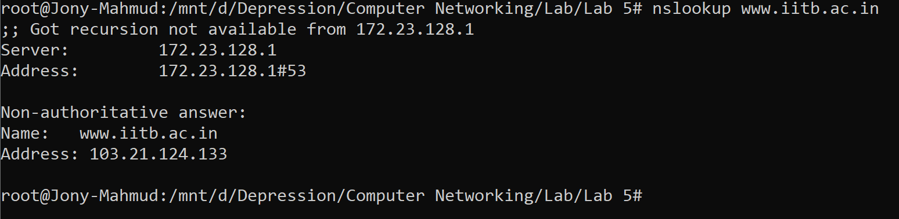

**Result:**  
The IP address for `www.iitb.ac.in` is **103.21.124.133**.

**Technical Note:** This demonstrates basic hostname-to-IP address resolution, the most fundamental DNS operation.

---

## Question 2

**Task:**  
What is the IP address of the DNS server that provided the answer to your `nslookup` command in Question 1?

**Answer:**  
The DNS server that provided the answer is **172.23.128.1**.

---

## Question 3

**Task:**  
Did the answer to your `nslookup` command in Question 1 come from an authoritative or non-authoritative server?

**Answer:**  
The answer was provided by a **non-authoritative** server.

---

## Question 4

**Task:**  
Use the `nslookup` command to determine the name of the authoritative name server for the `iitb.ac.in` domain. What is that name? (If there is more than one authoritative server, what is the name of the first authoritative server returned by `nslookup`?) If you had to find the IP address of that authoritative name server, how would you do so?

**Command:**
```sh
nslookup -type=ns iitb.ac.in
```

**Result:**  
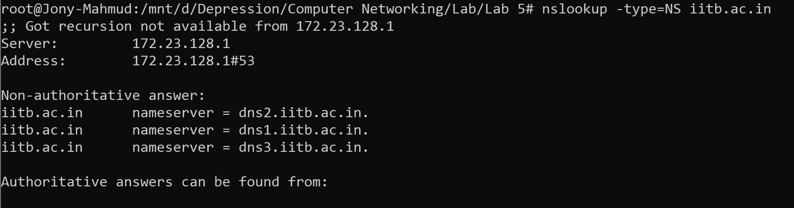

**Follow-up Command (to find IP address):**
```sh
nslookup dns2.iitb.ac.in
```

**Result:**  
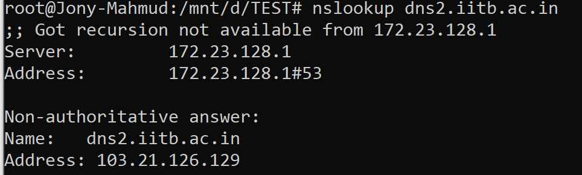

**Answer:**  
The first authoritative name server returned by `nslookup` is **dns2.iitb.ac.in**.  
To find its IP address, use `nslookup dns2.iitb.ac.in`. The IP address is **103.21.126.129**.

---

## Question 5

**Task:**  
Locate the first DNS query message resolving the name `gaia.cs.umass.edu`. What is the packet number in the trace for the DNS query message? Is this query message sent over UDP or TCP?

**Result:**  
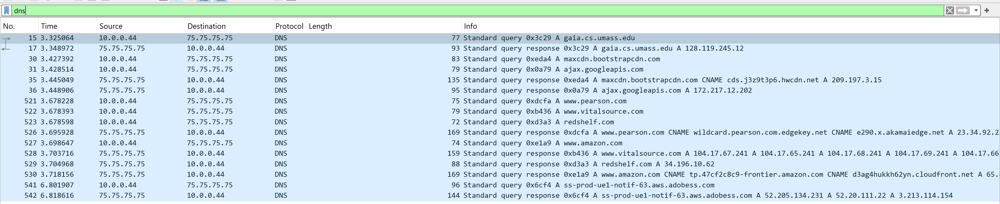
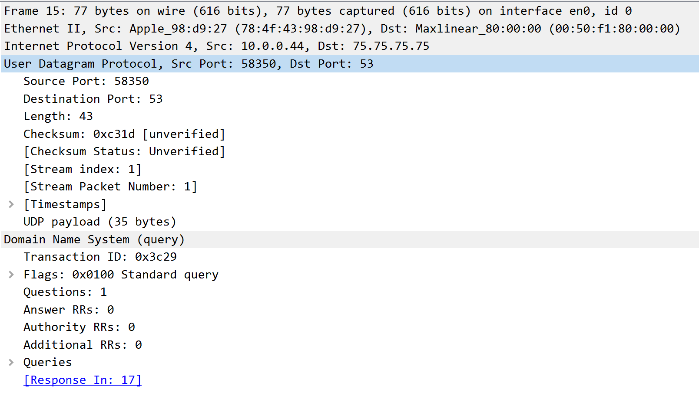

**Answer:**  
The DNS query for `gaia.cs.umass.edu` is in **packet number 15**.  
This query message is sent over **UDP**.

---

## Question 6

**Task:**  
Locate the corresponding DNS response to the initial DNS query. What is the packet number in the trace for the DNS response message? Is this response message received via UDP or TCP?

**Result:**  
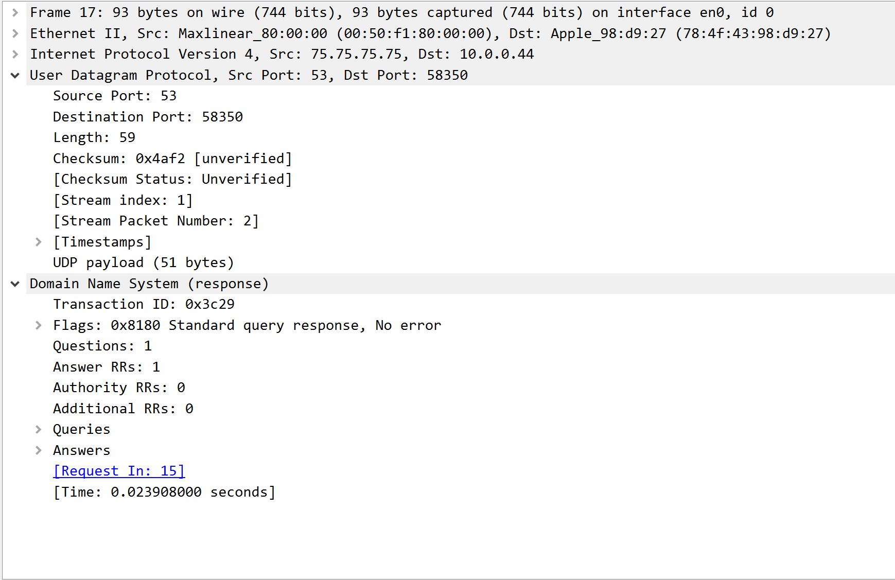

**Answer:**  
The DNS response is in **packet number 17** and is received via **UDP**.

---

## Question 7

**Task:**  
What is the destination port for the DNS query message? What is the source port of the DNS response message?

**Result:**  
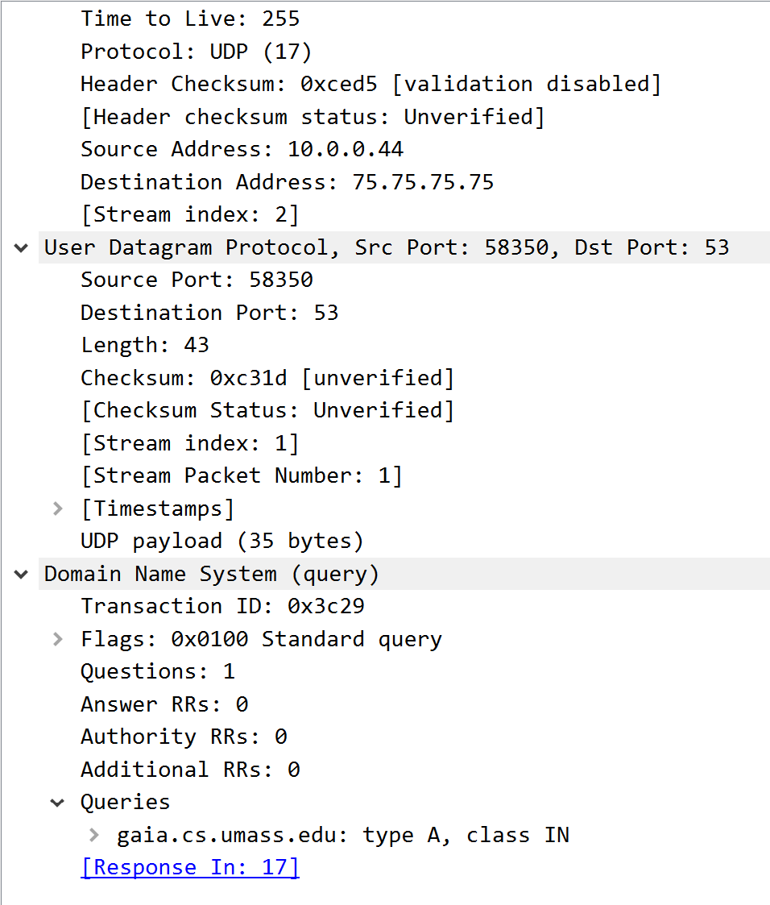

**Answer:**  
The destination port for the DNS query message is **53** (standard DNS port).  
The source port of the DNS response message is also **53**.

---

## Question 8

**Task:**  
To what IP address is the DNS query message sent?

**Result:**  
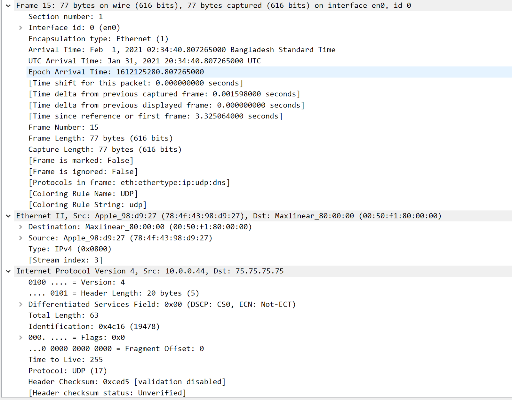

**Answer:**  
The DNS query message is sent to the IP address **75.75.75.75**.

---

## Question 9

**Task:**  
Examine the DNS query message. How many “questions” does this DNS message contain? How many “answers” does it contain?

**Result:**  


**Answer:**  
- Questions: **1**  
- Answers: **0**

---

## Question 10

**Task:**  
Examine the DNS response message to the initial query message. How many “questions” does this DNS message contain? How many “answers” does it contain?

**Result:**  


**Answer:**  
- Questions: **1**  
- Answers: **1**

---

## Question 11

The web page for the base file `http://gaia.cs.umass.edu/kurose_ross/` references the image object `http://gaia.cs.umass.edu/kurose_ross/header_graphic_book_8E_2.jpg`, which is also hosted on `gaia.cs.umass.edu`.

1. **What is the packet number in the trace for the initial HTTP GET request for the base file?**

    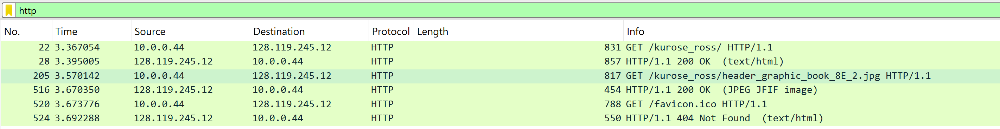

    **Answer:** 22

2. **What is the packet number in the trace of the DNS query made to resolve `gaia.cs.umass.edu` for this initial HTTP request?**

    

    **Answer:** 15

3. **What is the packet number in the trace of the received DNS response?**

    **Answer:** 17

4. **What is the packet number in the trace for the HTTP GET request for the image object?**

    **Answer:** 205

5. **What is the packet number in the DNS query made to resolve `gaia.cs.umass.edu` for this second HTTP request?**

    **Answer:** A new DNS query is not made for this second HTTP request.

6. **Discuss how DNS caching affects the answer to this last question.**

    **Answer:**  
    - Without caching: Every HTTP request to a hostname may require a DNS query and response.  
    - With caching (normal case): Only the first request requires DNS resolution; subsequent requests reuse the cached IP address.  
    - This is why, in most traces, only one DNS query/response pair appears for `gaia.cs.umass.edu`, even though multiple HTTP objects are retrieved.

---

# From 12 to 15 questions use file: `dns-wireshark-trace2-1.pcapng`

## Part 2: DNS Query Types and Message Analysis

## Question 12: DNS Port Analysis

**Objective:** Analyze the destination and source ports used in DNS communication.

**Screenshots:**  
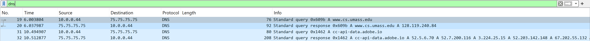  
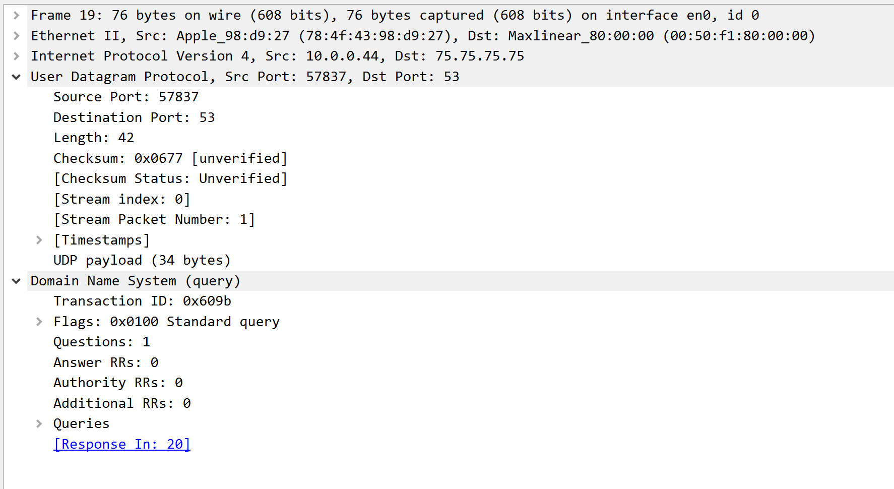  
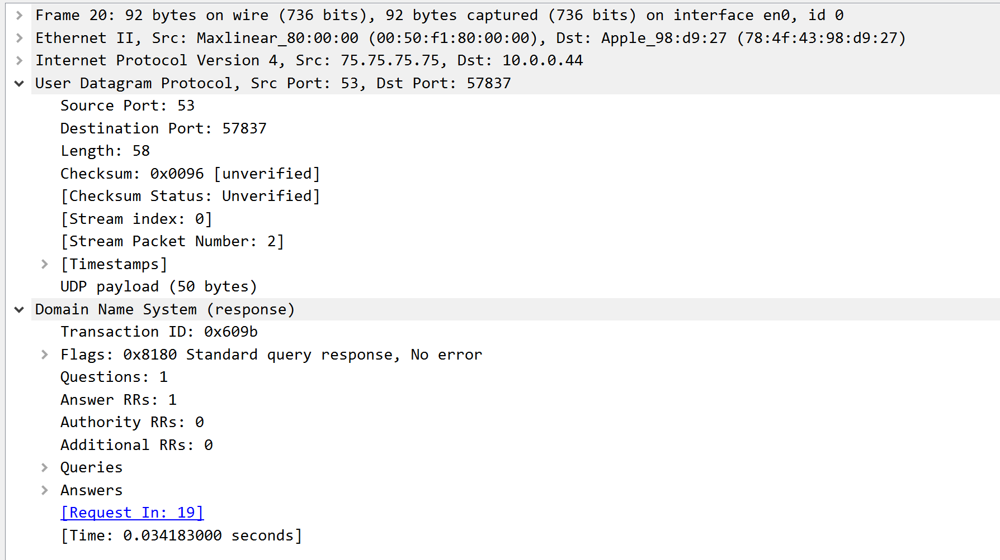

**Answer:**  
- **Destination Port:** 53 (standard DNS port)
- **Source Port:** 53 (DNS server standard port)

**Technical Note:** Both query and response use port 53, which is the well-known port assigned to DNS services.


## Question 13

**Task:**  
To what IP address is the DNS query message sent? Is this the IP address of your default local DNS server?

**Answer:**  
The DNS query message is sent to **75.75.75.75**.  
This is not the IP address of the default local DNS server; it is a public DNS server.

---

## Question 14

**Task:**  
Examine the DNS query message. What “Type” of DNS query is it? Does the query message contain any “answers”?

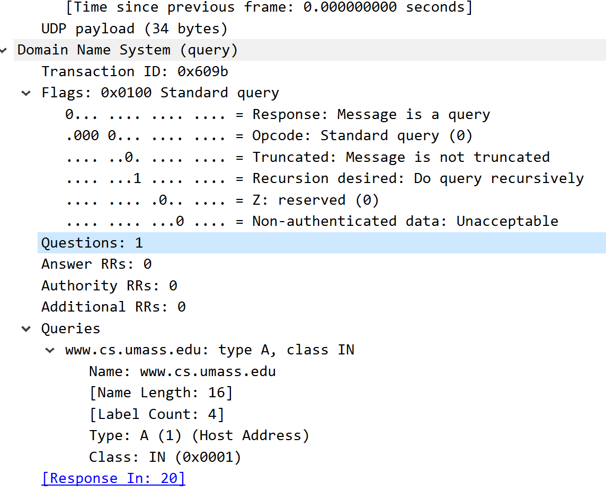

**Answer:**  
The DNS query is of type **A** (Address record for IPv4).  
The query message does **not** contain any answers.

---

## Question 15

**Task:**  
Examine the DNS response message to the query message. How many “questions” does this DNS response message contain? How many “answers”?

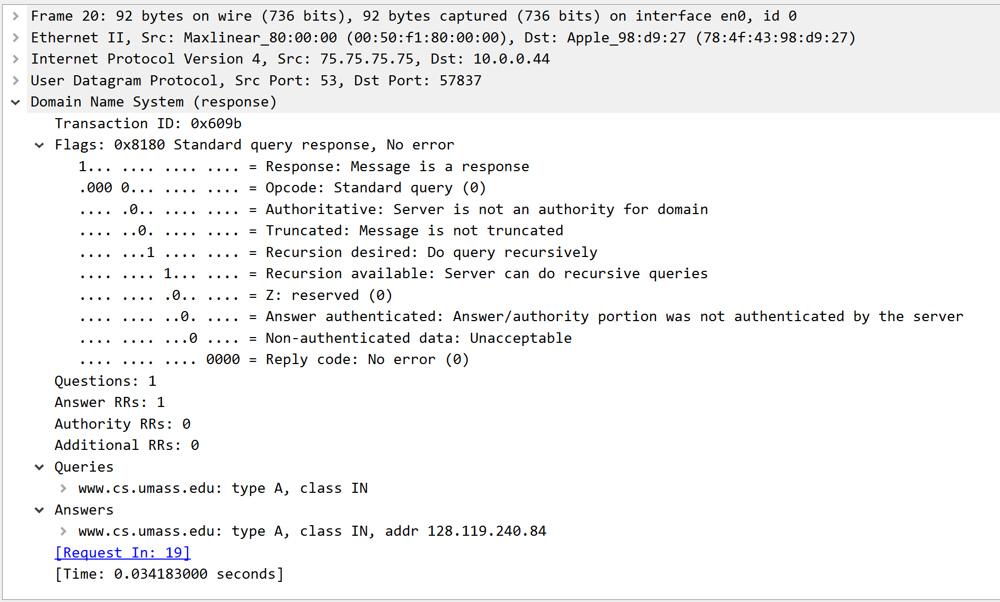

**Answer:**  
- Questions: **1**  
- Answers: **1**

---

# From 16 to 18 questions use file: `dns-wireshark-trace3-1.pcapng`

## Part 3: Authoritative Name Server Analysis

## Question 16

**Task:**  
To what IP address is the DNS query message sent? Is this the IP address of your default local DNS server?

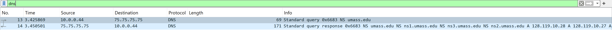

**Answer:**  
The DNS query message is sent to **75.75.75.75**.  
This is the IP address of the default local DNS server.

---

## Question 17

**Task:**  
Examine the DNS query message. How many questions does the query have? Does the query message contain any “answers”?

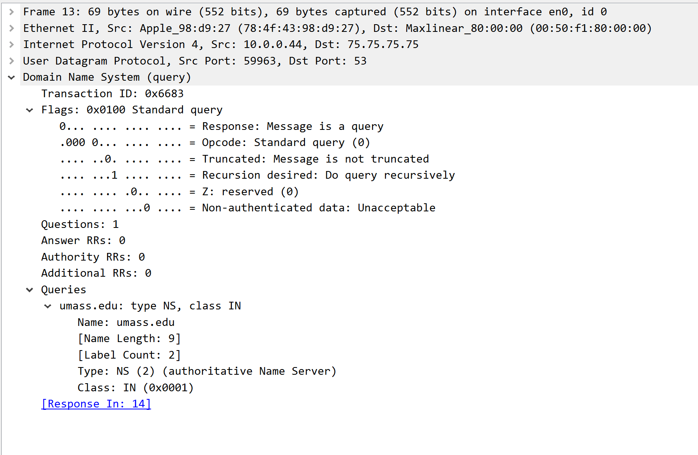

**Answer:**  
- Questions: **1**  
- Answers: **0**

---

## Question 18

**Task:**  
Examine the DNS response message (specifically the message with type “NS”).

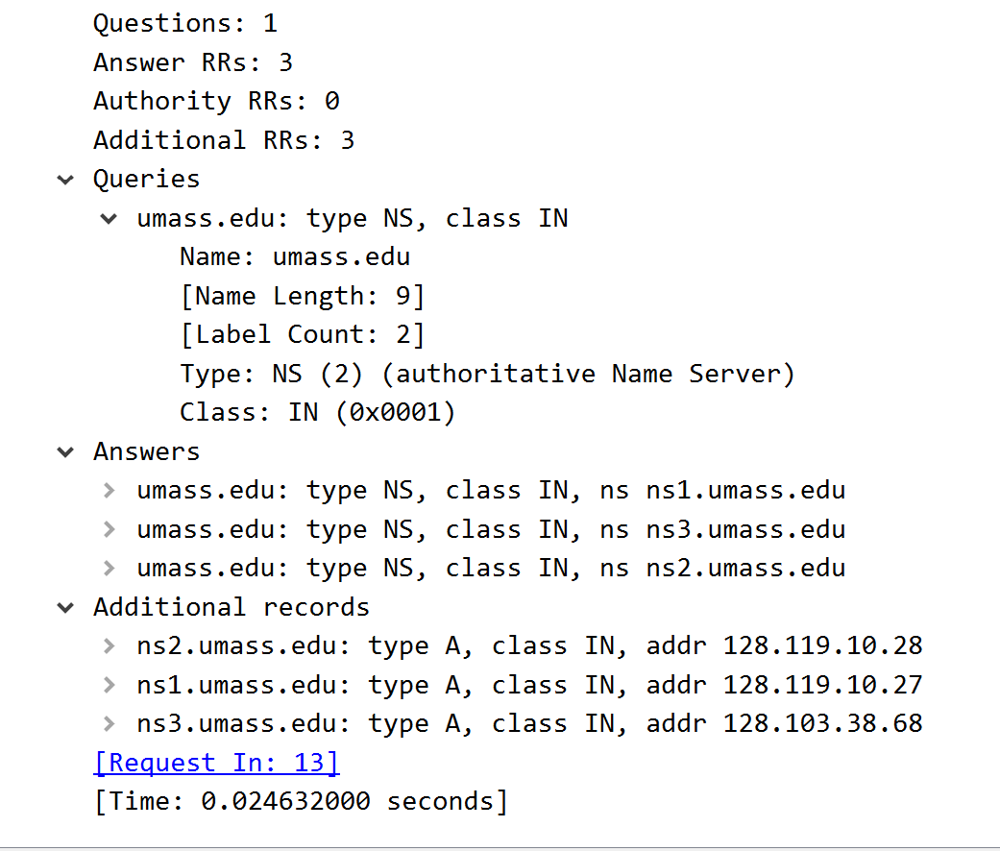

1. **How many answers does the response have?**  
    **Answer:** 3

2. **What information is contained in the answers?**  
    **Answer:**  
    The answers list the authoritative name servers for the `umass.edu` domain:  
    - `ns1.umass.edu`  
    - `ns2.umass.edu`  
    - `ns3.umass.edu`

3. **How many additional resource records are returned?**  
    **Answer:** 3  
    These additional records provide the IP addresses for the name servers listed above.

---

## Lab Summary and Key Learning Outcomes

### DNS Protocol Fundamentals
This lab demonstrated several key aspects of the Domain Name System:

#### **Transport Protocol Usage**
- **UDP Protocol**: DNS primarily uses UDP for queries and responses due to its lightweight nature
- **Port 53**: Standard port for DNS communication in both directions
- **Efficiency**: UDP reduces overhead compared to TCP for simple query-response transactions

#### **DNS Message Structure**
- **Query Messages**: Contain questions (typically 1) and no answers
- **Response Messages**: Echo the original question and provide answers
- **Packet Analysis**: Wireshark reveals the internal structure of DNS messages

#### **DNS Server Types and Hierarchy**
- **Local DNS Servers**: Typically provided by ISP (e.g., 172.23.128.1)
- **Public DNS Servers**: Alternative servers like 75.75.75.75 (Comodo Secure DNS)
- **Authoritative Servers**: Official source for domain information (e.g., dns2.iitb.ac.in)
- **Non-authoritative Responses**: Cached or forwarded answers from intermediate servers

### DNS Record Types Analyzed

| Record Type | Purpose | Example |
|-------------|---------|---------|
| **A Record** | Maps hostname to IPv4 address | `www.iitb.ac.in` → `103.21.124.133` |
| **NS Record** | Identifies authoritative name servers | `umass.edu` → `ns1.umass.edu`, `ns2.umass.edu`, `ns3.umass.edu` |
| **Additional Records** | Supplementary information (IP addresses of name servers) | Reduces need for follow-up queries |

### DNS Caching Behavior

#### **Observed Caching Effects:**
1. **First Request**: Requires DNS query (packet 15) and response (packet 17)
2. **Subsequent Requests**: No additional DNS queries needed
3. **Efficiency Gain**: Multiple HTTP requests to `gaia.cs.umass.edu` use cached IP address

#### **Performance Impact:**
- **Without Caching**: Each hostname reference requires DNS lookup
- **With Caching**: Significant reduction in network traffic and latency
- **Real-world Application**: Modern browsers and operating systems implement DNS caching

### Network Analysis Techniques

#### **Wireshark Skills Demonstrated:**
- Packet filtering for DNS traffic
- Identifying query-response pairs
- Analyzing packet timing and sequences
- Understanding protocol headers and message formats

#### **Command-line Tools:**
```bash
# Basic hostname resolution
nslookup www.example.com

# Query specific record types
nslookup -type=ns example.com
nslookup -type=a hostname.com

# Query specific DNS server
nslookup hostname.com 8.8.8.8
```

### Practical Applications

#### **Network Troubleshooting:**
- Identifying DNS resolution issues
- Verifying authoritative server responses
- Analyzing DNS performance and caching behavior

#### **Security Considerations:**
- Understanding DNS infrastructure
- Recognizing potential DNS manipulation
- Evaluating DNS server choices (ISP vs. public DNS)

#### **Performance Optimization:**
- DNS caching strategies
- Choosing optimal DNS servers
- Understanding resolution hierarchy

---

## Technical Specifications

### **Trace Files Used:**
1. `dns-wireshark-trace1-1.pcapng` - Basic DNS operations and caching analysis
2. `dns-wireshark-trace2-1.pcapng` - DNS query types and message structure
3. `dns-wireshark-trace3-1.pcapng` - Authoritative name server queries

### **Key Packet Numbers:**
- **DNS Query for gaia.cs.umass.edu**: Packet 15
- **DNS Response**: Packet 17  
- **Initial HTTP GET**: Packet 22
- **Image HTTP GET**: Packet 205

### **Network Addresses Identified:**
- **Local DNS Server**: 172.23.128.1
- **Public DNS Server**: 75.75.75.75 (Comodo Secure DNS)
- **Target Websites**: 
  - `www.iitb.ac.in`: 103.21.124.133
  - Authoritative server `dns2.iitb.ac.in`: 103.21.126.129

---

## Conclusion

This lab successfully demonstrated the fundamental workings of the DNS protocol through packet-level analysis. Key insights include:

1. **Protocol Efficiency**: DNS uses UDP for speed and simplicity
2. **Caching Importance**: Significantly reduces network traffic and improves performance
3. **Hierarchical Structure**: Different server types serve specific roles in the DNS ecosystem
4. **Message Format**: Standardized query-response structure enables reliable name resolution

The analysis reinforces the critical role of DNS in internet infrastructure and provides practical experience with network protocol analysis tools and techniques.


