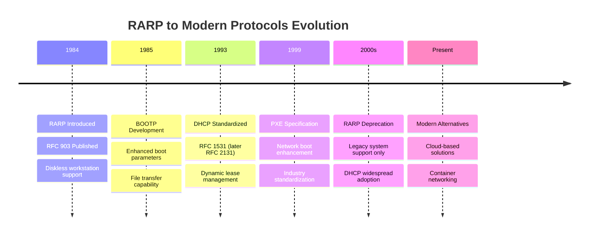

# RARP Command

## Introduction

**Reverse Address Resolution Protocol (RARP)** is a network protocol that performs the reverse function of ARP. While ARP maps IP addresses to MAC addresses, RARP maps MAC addresses to IP addresses. This protocol was primarily designed for diskless workstations and embedded systems that need to obtain their IP address during the boot process.

### Key Objectives

- Enable diskless systems to obtain IP addresses
- Support network booting processes
- Provide address resolution for embedded devices
- Facilitate automatic network configuration

### Current Status

> **Note**: RARP is largely obsolete in modern networks, having been superseded by DHCP (Dynamic Host Configuration Protocol) and BOOTP. However, understanding RARP is crucial for network fundamentals and legacy system support.

---

## Protocol Overview

### RARP Architecture

```
┌─────────────────┐    RARP Request    ┌─────────────────┐
│   Diskless      │ ──────────────────► │   RARP Server   │
│   Workstation   │                    │                 │
│  MAC: Known     │ ◄────────────────── │  IP Database    │
│  IP: Unknown    │    RARP Reply      │                 │
└─────────────────┘                    └─────────────────┘
```

### RARP vs Traditional Networking

| **Aspect**        | **Traditional Host** | **RARP Client**  |
| ----------------------- | -------------------------- | ---------------------- |
| **Storage**       | Local disk with config     | No local storage       |
| **IP Source**     | Static/DHCP assignment     | RARP server lookup     |
| **Boot Process**  | Local OS boot              | Network-dependent boot |
| **Configuration** | Persistent settings        | Dynamic assignment     |

### RARP Process Flow

1. **Initialization**: Diskless client powers on with known MAC address
2. **Broadcast Request**: Client broadcasts RARP request containing its MAC
3. **Server Lookup**: RARP server searches database for MAC-to-IP mapping
4. **Response**: Server replies with assigned IP address
5. **Configuration**: Client configures network interface with received IP

### RARP Packet Structure

```
┌─────────────────────────────────────────────────────────────┐
│ Hardware Type (16 bits) │ Protocol Type (16 bits)           │
├─────────────────────────────────────────────────────────────┤
│ HW Addr Len (8) │ Proto Addr Len (8) │ Operation (16 bits) │
├─────────────────────────────────────────────────────────────┤
│ Sender Hardware Address (48 bits)                           │
├─────────────────────────────────────────────────────────────┤
│ Sender Protocol Address (32 bits)                           │
├─────────────────────────────────────────────────────────────┤
│ Target Hardware Address (48 bits)                           │
├─────────────────────────────────────────────────────────────┤
│ Target Protocol Address (32 bits)                           │
└─────────────────────────────────────────────────────────────┘
```

#### Operation Codes

| **Code** | **Type** | **Description**            |
| -------------- | -------------- | -------------------------------- |
| 3              | RARP Request   | Client requesting IP for its MAC |
| 4              | RARP Reply     | Server providing IP address      |

---

## RARP vs ARP Comparison

### Detailed Comparison Table

| **Feature**         | **ARP**      | **RARP**            |
| ------------------------- | ------------------ | ------------------------- |
| **Purpose**         | IP → MAC mapping  | MAC → IP mapping         |
| **Direction**       | Forward resolution | Reverse resolution        |
| **Initiator**       | Any network host   | Diskless/embedded systems |
| **Server Required** | No central server  | Dedicated RARP server     |
| **Cache Type**      | Local ARP table    | Server database           |
| **Modern Usage**    | Active/Essential   | Obsolete/Legacy           |
| **Replacement**     | Still in use       | DHCP/BOOTP                |

## Command Syntax & Options

### Basic Syntax

```bash
rarp [options] [interface]
```

>  **Availability Note**: RARP commands are not available on modern systems by default, as the protocol is deprecated.

## Historical Context

### 🕰️ Evolution Timeline



### Legacy System Support

#### **When RARP is Still Relevant:**

- **Legacy Industrial Systems**: Old embedded controllers
- **Historical Network Analysis**: Understanding old protocols
- **Educational Purposes**: Network protocol fundamentals
- **Reverse Engineering**: Analyzing vintage hardware

---

## Summary

### Key Takeaways

| **Aspect**             | **Details**                                    |
| ---------------------------- | ---------------------------------------------------- |
| **Historical Purpose** | Enabled diskless workstations to obtain IP addresses |
| **Protocol Function**  | MAC-to-IP address resolution (reverse of ARP)        |
| **Current Status**     | Obsolete, replaced by DHCP and BOOTP                 |
| **Educational Value**  | Important for understanding network fundamentals     |
| **Legacy Support**     | Still relevant for vintage and embedded systems      |

### Modern Context Applications

- **Network Education**: Understanding protocol evolution and fundamentals
- **Historical Analysis**: Studying legacy network implementations
- **System Integration**: Supporting vintage industrial equipment
- **Protocol Research**: Analyzing early network boot mechanisms
- **Troubleshooting**: Diagnosing issues in mixed-age environments
