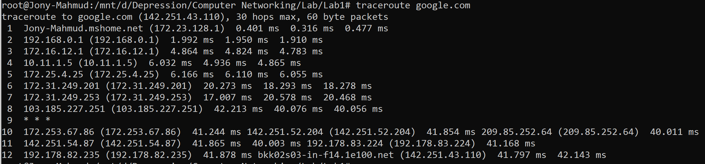

# Traceroute Command 

## Introduction

**Traceroute** is a fundamental network diagnostic tool used to trace the path that packets take from your computer to a specified destination (such as `google.com`). It provides visibility into each intermediary device (router or gateway) that handles your data along the way, helping to identify network bottlenecks or failures.

---

## How Traceroute Works

- **Packet Probing:** Traceroute sends a series of packets toward the destination, each with an incrementally increasing Time To Live (TTL) value.
- **TTL Mechanism:** The TTL value determines how many hops (routers) a packet can traverse before being discarded. Each router that forwards the packet decrements the TTL by 1. When TTL reaches zero, the router discards the packet and sends back an ICMP "Time Exceeded" message.
- **Hop Discovery:** By analyzing these ICMP responses, traceroute identifies each hop along the route to the destination.
- **Round-Trip Time (RTT):** For each hop, traceroute measures the time taken for the probe to reach the router and for the response to return, providing latency information.

---

## Example Output and Interpretation

```
traceroute google.com
```



```
traceroute to google.com (142.251.43.110), 30 hops max, 60 byte packets
```

- **Destination:** `google.com` (IP: 142.251.43.110)
- **Maximum Hops:** 30 (traceroute will stop after 30 hops if the destination is not reached)
- **Packet Size:** 60 bytes per probe

### Sample Hop Analysis

| Hop | Address / Info | Description |
|-----|----------------|-------------|
| 1 | 172.23.128.1 (Jony-Mahmud.mshome.net) | Local device or virtual adapter (e.g., WSL2/Hyper-V NAT) |
| 2 | 192.168.0.1 | Home WiFi router (default gateway) |
| 3 | 172.16.12.1 | ISP’s first router (private IP) |
| 4 | 10.11.1.5 | Additional ISP internal router (private IP) |
| 5 | 172.25.4.25 | Further ISP internal routing |
| 6–7 | 172.31.249.201/253 | ISP edge routers (transition to external network) |
| 8 | 103.185.227.251 | Public IP (ISP or upstream provider, possibly international gateway) |
| 9 | * * * | No response (router/firewall drops probes; common and not necessarily problematic) |
| 10 | 172.253.67.86, 142.251.52.204, 209.85.252.64 | Within Google’s network (load balancing, multiple IPs) |
| 11 | 142.251.54.87, 192.178.83.224 | Google backbone routers |
| 12 | 192.178.82.235, bkk02s03-in-f14.1e100.net (142.251.43.110) | Final destination (Google’s Bangkok datacenter) |

---

## Key Concepts

- **Private IP Addresses:** Ranges such as `10.x.x.x`, `172.16.x.x–172.31.x.x`, and `192.168.x.x` are reserved for internal use within networks (LANs or ISP backbones).

- **Public IP Addresses:** Indicate that traffic has exited private networks and is traversing the public internet.

- **Unresponsive Hops (\*):** Some routers or firewalls are configured to ignore traceroute probes, resulting in asterisks. This is normal and does not always indicate a problem.

- **Multiple IPs per Hop:** Large networks (like Google’s) may use load balancing, causing multiple IP addresses to appear for a single hop.

- **RTT (ms):** The round-trip time to each hop, useful for identifying latency spikes that may indicate network congestion or long-distance links.

- **Three RTT Values per Hop:** Each hop typically shows three round-trip times (e.g., `42.213 ms  40.076 ms  40.056 ms`) because traceroute sends three probe packets per hop by default. These values help reveal variability in network latency and can indicate intermittent delays or packet loss.


---

## Practical Applications

- **Visualize Network Paths:** Understand the route your data takes to reach a destination.
- **Identify Latency Points:** Pinpoint where delays or high latency occur along the path.
- **Detect Network Boundaries:** Observe where traffic transitions from your LAN to your ISP, and from your ISP to external networks.
- **Troubleshoot Connectivity:** Locate where packet loss or connectivity issues arise, aiding in efficient problem resolution.

---

## Summary

Traceroute is an essential tool for network diagnostics and troubleshooting. By mapping each hop between your device and a remote server, it provides valuable insights into network structure, performance, and potential problem areas. Mastery of traceroute enables effective identification and resolution of connectivity and latency issues in complex network environments.

